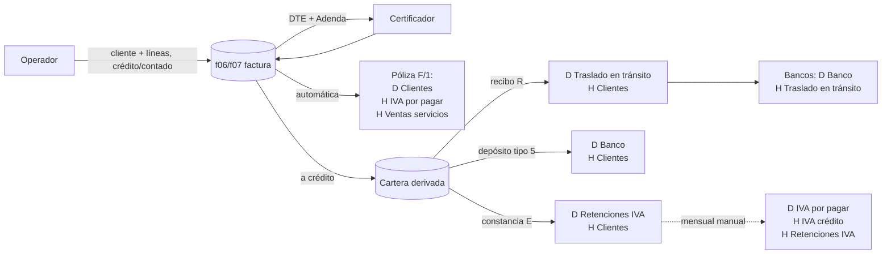

# Discovery Milenium: Facturación → CxC → Contabilidad (referencia: Logiservicios Mónaco)

Estado: **DISCOVERY / DOCUMENTACIÓN. Cero código, cero SQL, cero migraciones, cero producción, cero asientos reales.** No implementa FEL, INFILE, SAT, motor contable ni reglas fiscales.
Fecha: 2026-10-10. Base de SITSA revisada: `origin/main` posterior a #433.
Complementa (no repite): [`AUDITORIA-MILENIUM-CONTABILIDAD-FACTURACION`](AUDITORIA-MILENIUM-CONTABILIDAD-FACTURACION.md) · [`MILENIUM-INVENTARIO-FUNCIONAL`](MILENIUM-INVENTARIO-FUNCIONAL.md) · [`MILENIUM-CONTABILIDAD-HOMOLOGACION-CATALOGO`](MILENIUM-CONTABILIDAD-HOMOLOGACION-CATALOGO.md) · [`CONTABILIDAD-C2/C3A/C3B/C3C`](CONTABILIDAD-C3C-DISCOVERY-PERIODOS-NUMERACION.md) · [`FACTURACION-VIAJES-FASE1`](FACTURACION-VIAJES-FASE1.md).

## 0. Cómo se hizo, límites y cómo leer este documento

**Método.** Análisis **estático y de solo lectura** de la copia local de Milenium (`Downloads/Milenium2000`, datos hasta 2026-05-27), de **dos facturas de ejemplo** de Mónaco (PDF del 2026-10-09), del manual de usuario (139 págs., 2014), de las plantillas de reporte (`.FRX`), del catálogo de menú (`opciones`), de 9 XML FEL de ejemplo y de las tablas DBF de las empresas `08` (Mónaco actual), `01` (KT) y `00` (Mónaco histórico). Los DBF se leyeron con un lector propio de solo lectura (`open(..., 'rb')`); **no se ejecutó ningún EXE/DLL de Milenium, no se escribió en la copia, no se copiaron datos al repositorio**. Todo número de este documento es **agregado** (conteos, proporciones); **no aparece ningún NIT, nombre de cliente, número de cuenta bancaria, credencial ni importe individual**. Los ejemplos numéricos de pólizas son **sintéticos**.

**Limitación principal.** No hay código fuente de Milenium (solo `sistema.EXE` compilado). Lo que el programa *hace* con los datos se reconstruye a partir de **datos, plantillas, manual y menú**; por eso cada afirmación lleva una etiqueta que **no se mezcla**:

| Etiqueta | Significado |
|---|---|
| **[CONFIRMADO]** | Visto directamente en datos, plantillas, manual o archivos de la copia (se indica la fuente). |
| **[INFERENCIA]** | Deducción razonable a partir de nombres, estructura o patrones de datos; **puede estar equivocada**. No debe convertirse en regla sin validación. |
| **[PENDIENTE CONTABILIDAD]** | No puede determinarse con la copia, o es una regla/decisión contable. **No se implementa hasta que Contabilidad responda** (ver §N). |

> **Regla de este proyecto**: no se implementa ninguna regla fiscal ni contable que descanse solo en una **[INFERENCIA]**. Lo observado en datos se documenta como *comportamiento histórico de Milenium*, no como *norma correcta*: Milenium puede haber estado mal parametrizado.

---

## 1. Resumen ejecutivo

1. **La factura de Mónaco no se genera con los reportes locales de Milenium.** Los PDF de Mónaco (los 2 ejemplos y la carpeta `FacturasPdf` de 2025) tienen como creador **JasperReports 6.19.1 / iText 2.1.7** y llevan QR FEL, «Folio 1 de 1» y *Complemento factura cambiaria*; los reportes locales (`fFacturaFel*.FRX`) producen «Código / Descripción / Total» (KT: factura de referencia «… 4855») por *Microsoft Print to PDF* o *Haru*. **[CONFIRMADO]** (metadatos de los PDF). Que el generador de Mónaco sea el **certificador (INFILE)** es **[INFERENCIA]** (§B.5).
2. **Mónaco usa otro formato que KT**: tabla `CANTIDAD | DESCRIPCIÓN | PRECIO UNITARIO | VALOR`, complemento de factura cambiaria (abono único), leyenda ISR y datos de la Adenda (crédito, código de cliente, No. interno). El PDF demo actual (formato KT «Código/Descripción/Total») **no sirve para Mónaco**. **[CONFIRMADO]**
3. **«1 viaje = 1 línea» es falso en Milenium** (que no tiene viajes). La línea es un *servicio agrupado*: `«N SERVICIO(S) DE <tipo>: FLETE DE <abreviatura del cliente> HACIA <destino> FECHA <d-m-aaaa> <placas>»` + una línea **aparte** de descarga. Históricamente `CANTIDAD = 1` en el 98.7 % de las líneas y el «N servicios» vive en el texto; en las dos facturas de octubre 2026 la cantidad ya es real (`valor = cantidad × unitario`). **[CONFIRMADO]**; el criterio de agrupación es manual y **no está codificado en los datos** → **[PENDIENTE CONTABILIDAD]**.
4. **Póliza de ventas automática**: Debe *Clientes locales*; Haber *IVA por pagar* y *Ventas de servicios* (613 de 616 pólizas de facturación en Mónaco). Se parametriza en `f10` (menú: *Facturación → Utilitarios → Póliza de ventas…*). **[CONFIRMADO]**
5. **IVA 12 % incluido en el precio**: `IVA = total / 1.12 × 0.12` en 718 de 721 facturas (las otras 3, exentas). **[CONFIRMADO]**
6. **ISR**: Milenium **no calcula ISR en ventas**. La leyenda «Sujeto a pagos trimestrales» sale de un campo de texto por serie (`TIPRET`) y de la frase SAT tipo 1/escenario 1. Hay **retenciones de ISR a proveedores por rangos** (5 % de Q2,500 a Q30,000; 7 % arriba) solo en CxP. **No hay evidencia de retención de ISR por clientes.** **[CONFIRMADO]**
7. **Retención de IVA del cliente = documento de CxC tipo `E`** («nota de crédito de aplicación directa», con la marca `RETIVA`). Su póliza es **Debe *Retenciones de IVA* (activo 11302005) / Haber *Clientes locales***. En 497 de 573 aplicaciones (87 %) el monto es **el 15 % del IVA de la factura**. Se captura **a mano**, con el número de la constancia del cliente. **[CONFIRMADO]**; que la retención sea *siempre* 15 % y su tratamiento fiscal → **[PENDIENTE CONTABILIDAD]**.
8. **El IVA retenido se liquida contra el IVA por pagar** en una **póliza manual mensual**: Debe *IVA por pagar* / Haber *IVA por cobrar (crédito)* y *Retenciones de IVA*. **[CONFIRMADO]** (en 13 de 32 pólizas de liquidación; las demás combinan otros movimientos).
9. **El saldo de CxC se deriva** (no hay campo de saldo): factura a crédito − aplicaciones (cobros, notas de crédito, retenciones). Vencimiento = fecha de emisión + días de crédito (verificado en el XML). **[CONFIRMADO]**
10. **La plataforma ya tiene la base contable** (`cont_entidades`, `cont_cuentas`, `cont_asientos` + detalle transaccional por entidad, `cont_cxc/cxp` simples) y la facturación interna (`fact_*`), **pero sin ningún vínculo entre ambas**, sin tipos de póliza, períodos, numeración, naturaleza de cuenta, retenciones, aplicaciones de cobro ni libro de ventas (§L, §M).

---

## A. Flujo actual completo en Milenium (Mónaco, empresa `08`)

| # | Paso | Qué ocurre | Fuente | Etiqueta |
|---|---|---|---|---|
| 1 | Captura | El operador digita la factura (*Facturación → Ingreso de transacciones → Ingreso de facturación normal / por código de cliente*): cliente, ruta, bodega, forma de pago, lista de precios, vendedor, contado/crédito, días de crédito, observaciones y líneas (artículo + cantidad + precio con IVA incluido + **descripción libre**). No hay selección de «viaje». | Manual p. 66–69; `f06`/`f07` | CONFIRMADO |
| 2 | Parámetro de precio | El parámetro *«En las facturas pide el total»* decide si se digita el **total de la línea** o el **precio unitario** (siempre con IVA incluido). Explica por qué históricamente `cantidad = 1` y precio = total. | Manual p. 67 | CONFIRMADO (efecto en datos: INFERENCIA) |
| 3 | Serie y tipo | La **serie** elegida determina el tipo de documento: `F3` = FCAM (factura cambiaria, FEL activa), `FL` = serie anterior sin FEL, `NF` = NCRE, `ES` = FESP. | `f12`, `f50` | CONFIRMADO |
| 4 | Cálculo | `SUBTOT`, `TOTFAC`, `TOTIVA` (IVA incluido), separación bienes/servicios/exento (`TOTBIE/TOTSER/TOTEXE`). Moneda `GT`, tasa 1. | `f06` | CONFIRMADO |
| 5 | Certificación | Milenium arma el DTE sin firmar (+Adenda) y lo envía al certificador; guarda `AUTFEL/NUMFEL` en la factura y todo el intercambio en `f61`. Detalle en la auditoría previa §7. | `f06`, `f61` | CONFIRMADO |
| 6 | Póliza | Si la póliza de ventas está parametrizada (`f10`), **se genera sola al emitir**: sistema `F`, módulo `1`, número = serie+correlativo. | `f10`, `co03` | CONFIRMADO |
| 7 | Cartera | Si la factura es a crédito nace como documento de cartera: `CREDIT=true`, `DIASCR`. No existe campo de saldo ni de «vencida». | `f06`, `cc03` | CONFIRMADO |
| 8 | Cobro (vía CxC) | *Operación de pagos y liquidación de documentos* → documento `R` (recibo) con aplicación a una o varias facturas (`cc05` + `cc03`). Póliza: **D *Traslado en tránsito* / H *Clientes locales*** (95 en Mónaco). | `cc05`, `co03`, manual p. 77 | CONFIRMADO |
| 9 | Depósito | El depósito bancario cierra el tránsito: **D *Banco* / H *Traslado en tránsito*** (127 pólizas de bancos tocan esa cuenta). | `co03` (B) | CONFIRMADO |
| 10 | Cobro (vía Bancos) | Alternativa: transacción bancaria tipo `5` con cliente → **D *Banco* / H *Clientes locales***, con aplicación a facturas en `cc03` (módulo `B`/`5`; 181 depósitos, 461 aplicaciones). | `b03`, `cc03`, `co03` | CONFIRMADO |
| 11 | Retención IVA | El cliente entrega constancia; se registra un documento `E` aplicado a la factura (§H). | `cc05` | CONFIRMADO |
| 12 | Nota de crédito | Desde CxC → *Notas de crédito FEL* (serie `NF`, tipo `C`, certificada): póliza **D *IVA por pagar* + D *Dev. sobre ventas* / H *Clientes locales*** (7 documentos —1 anulado— en Mónaco; 138 en KT). | `cc05`, `co03` | CONFIRMADO |
| 13 | Anulación | Marca `ANULAD_CFA`, motivo `CODANU` (catálogo *Motivos de anulación*; en Mónaco: 94 anuladas, motivos `01`/`02`) y evento de anulación FEL. **Ninguna de las 94 anuladas tiene póliza**, y las 627 vigentes sí. | `f06`, `co03` | CONFIRMADO |
| 14 | Cierre IVA | Póliza **manual** de liquidación mensual (§F). | `co03` (0/0) | CONFIRMADO |
| 15 | Libros | *Contabilidad → Reportes del IVA*: Libro de ventas, archivo ASISTE LIBROS, cuadre del IVA por cobrar. | Menú | CONFIRMADO (existencia); contenido PENDIENTE |



---

## B. Modelo de la factura de Mónaco

### B.1 Elementos del PDF real (2 facturas de ejemplo, 2026-10-09) y su origen

| Elemento del PDF | De dónde sale | Etiqueta |
|---|---|---|
| Logo Mónaco | Imagen del emisor en la plantilla del generador | CONFIRMADO |
| «DOCUMENTO TRIBUTARIO ELECTRÓNICO» + «Factura Cambiaria Electrónica» | Tipo FCAM (serie `F3`, `TIPDOC=5`) | CONFIRMADO |
| **Serie** | Primer segmento del número de autorización (UUID) | CONFIRMADO (visto: coincide con el UUID) |
| **No.** | Número de DTE asignado por el certificador | CONFIRMADO |
| **Crédito** («100») | Días de crédito: `f06.DIASCR`; en el XML, `Adenda/DiasCredito`. El rótulo dice «Crédito» aun cuando el valor son días | CONFIRMADO (valor); rótulo, INFERENCIA |
| **Código cliente** | `Adenda/CodigoCliente` (código interno de `cc01`) | CONFIRMADO |
| **No. interno** («F3-0000000854») | `Adenda/CorrelativoInterno` = serie interna + correlativo local de Milenium | CONFIRMADO |
| DÍA / MES / AÑO | Fecha de la factura (`FECHA_CFA`; en el DTE `FechaHoraEmision`) | CONFIRMADO |
| Bloque emisor (nombre comercial, razón social, dirección, NIT) | Datos de la serie en `f50` / emisor del DTE | CONFIRMADO |
| Nombre, NIT, dirección, **e-mail** del receptor | `NOMCLI/NITCLI/DIRCLI` congelados en la factura; e-mail del receptor del DTE | CONFIRMADO |
| Tabla `CANTIDAD \| DESCRIPCIÓN \| PRECIO UNITARIO \| VALOR` | `f07`: `CANART`, `OTRDES` (descripción libre), `PREUNI`, `PRETOT` | CONFIRMADO |
| **COMPLEMENTO FACTURA CAMBIARIA**: número de abono, monto del abono, fecha de vencimiento | XML `Complemento/AbonosFacturaCambiaria/Abono`: `NumeroAbono = 1`, `MontoAbono = GranTotal`, `FechaVencimiento = emisión + DiasCredito` | CONFIRMADO (verificado en 9 XML: abono único = total; vencimiento = emisión + días en los 3 documentos a crédito con días numéricos; 1 documento «contado» con días numéricos no cumple → anomalía de datos) |
| Leyenda «Sujeto a pagos trimestrales ISR» | Frase SAT tipo 1 / escenario 1 del DTE (`TIPFRAF=1`, `CODESCF=1` en `f50`); texto configurado por serie en `TIPRET` («SUJETO A PAGOS TRIMESTRALES») | CONFIRMADO |
| TOTAL EN LETRAS | `NumLet(TotFac)`: «… QUETZALES CON NN/100» | CONFIRMADO |
| Total | `TOTFAC_CFA` | CONFIRMADO |
| Número de autorización, fecha de certificación, certificador (nombre y NIT), QR y logo FEL | Respuesta del certificador / DTE certificado | CONFIRMADO |
| «Folio 1 de 1» | Paginación del generador | CONFIRMADO |

### B.2 Diferencias contra el formato KT (factura de referencia de KT «… 4855»)

| | **KT** (reporte local `fFacturaFel`) | **Mónaco** (PDF de ejemplo) |
|---|---|---|
| Columnas | `CÓDIGO \| DESCRIPCIÓN \| TOTAL` | `CANTIDAD \| DESCRIPCIÓN \| PRECIO UNITARIO \| VALOR` |
| Crédito | «CONDICIONES: CONTADO» o «CRÉDITO *n* DÍAS» (**regla del reporte: si `DIASCR > 3` muestra los días; si no, muestra «15»**) | Casilla «Crédito: *n*» (días) |
| Cambiaria | No muestra complemento | **COMPLEMENTO FACTURA CAMBIARIA** (abono, monto, vencimiento) |
| Leyenda ISR | Texto en el cuerpo (`TIPRET`) | «Sujeto a pagos trimestrales ISR» |
| QR / logo FEL | No | Sí |
| Generador | Reporte FoxPro (*Microsoft Print to PDF*) | JasperReports |

> **Consecuencia [CONFIRMADO]**: la regla «`DIASCR > 3 ? días : 15`» del reporte local es un *artefacto del reporte*, no una regla de negocio; **no debe copiarse**.

### B.3 Lo que la plataforma necesita para representar la factura de Mónaco (no implementado)
Cantidad y precio unitario por línea (hoy `fact_factura_viajes` es una fila por viaje); líneas agrupadas con descripción generada; abono único (número, monto, vencimiento); días de crédito congelados; código de cliente y No. interno congelados; leyenda por serie/frase; correo del receptor; y, tras FEL, serie/número/autorización/fecha de certificación/certificador/QR. **Cada emisor necesita su propia plantilla** (Mónaco ≠ KT).

### B.4 Datos del emisor que existen en Milenium
`f50` por serie: NIT, razón social, nombre comercial, dirección, municipio, departamento, código postal, correo, **teléfono** (`TELEFO_SFA`), encabezado de reporte (`LINREP1/2`: nombre + dirección + teléfono), establecimiento (`CODESTF=1`), afiliación IVA (`TIPAFIF=GEN`), moneda. (Los valores no se reproducen.) **[CONFIRMADO]**. Esto responde el faltante «teléfono del emisor» de FACT-3.

### B.5 ¿Quién genera el PDF de Mónaco?
**[CONFIRMADO]**: metadatos = *JasperReports 6.19.1 + iText 2.1.7*; no es el reporte FRX/Haru local. **[INFERENCIA]**: es la *representación gráfica* que produce el certificador a partir del XML (incluye datos de la Adenda y el complemento, que solo existen en el DTE). **[PENDIENTE CONTABILIDAD/TI]**: confirmar quién lo genera hoy (¿portal del certificador, Milenium «certificación masiva», otro sistema?) y si se puede **personalizar** (logo, textos) o hay que producir un PDF propio con el mismo diseño. Define si la plataforma debe *generar* el PDF o *descargarlo* del certificador.

---

## C. Agrupación de líneas / servicios

### C.1 Lo que sí se observa (Mónaco `08`, 2023-09-02 → 2026-05-27; 721 facturas, 2 028 líneas)
| Hecho | Cifra | Etiqueta |
|---|---|---|
| Líneas por factura | 1 línea: 420 · 2: 53 · 3–5: 143 · 6 o más: 111 (máx. 12) | CONFIRMADO |
| `CANART = 1` | 2 001 de 2 028 (98.7 %); solo 21 con cantidad > 1 | CONFIRMADO |
| `PRETOT = CANART × PREUNI` | 2 022 de 2 028 | CONFIRMADO |
| Catálogo de artículos usado | camión 10 TN 1 320 · camión 5 TN 320 · contenedor 265 · «servicios prestados» 71 · cuadrilla 31 · transporte 18 | CONFIRMADO |
| Líneas que mencionan «DESCARGA» | 555 (27 %); **el artículo es el mismo del vehículo** (camión 10 TN 454, contenedor 52, cuadrilla 29): la descarga se distingue **solo en el texto** | CONFIRMADO |
| Facturas con flete **y** descarga | 205 de 348 con descripción de flete/descarga; en 130 coincide el número de líneas de flete y de descarga | CONFIRMADO |
| Precios unitarios distintos | fletes: 131 valores (los más repetidos se repiten decenas de veces → **tarifa**); descargas: 52 valores (750, 1 250, 2 500, 3 750… por lugar) | CONFIRMADO |
| Descuentos | 0 líneas con descuento | CONFIRMADO |
| `OBSERV_CFA` | 721 de 721 con texto corto («RENTA DE CAMIÓN» 360, «SERVICIO DE CAMION» 88, «RENTA DE CONTENEDOR» 57…) | CONFIRMADO |

### C.2 Plantilla de descripción (anonimizada con marcadores)
```
<N> SERVICIO(S) DE <CAMIÓN | CONTENEDOR>: FLETE DE <ABREV. CLIENTE> HACIA|PARA <DESTINO> [FECHA <d-m-aaaa>] <PLACA1>, <PLACA2>, …
SERVICIO(S) DE DESCARGA <LUGAR> [DE FECHA <d-m-aaaa>] <PLACA1>, <PLACA2>, …
```
- **Placas**: se enumeran en la descripción (tractocamión / contenedor `TC-…`, camión `C-…`). **[CONFIRMADO]**
- **Fecha**: una fecha por línea (la del servicio), en formato `d-m-aaaa`; una misma factura mezcla varias fechas. **[CONFIRMADO]**
- **«N»** aparece como prefijo textual cuando agrupa más de un servicio; en las facturas de octubre 2026 coincide con la columna `CANTIDAD`. **[CONFIRMADO]**
- Las dos facturas de ejemplo muestran el patrón completo: p. ej. `3 SERVICIOS DE CONTENEDOR … (3 placas) FECHA …` con **cantidad 3, unitario U, valor 3×U**, seguida de `SERVICIO DE DESCARGA <lugar> (mismas placas) FECHA …` con **cantidad 3, unitario D, valor 3×D**.

### C.3 Cómo se decide (lo que **no** está en los datos)
| Pregunta | Respuesta soportada |
|---|---|
| ¿Qué viajes se agrupan? | **[INFERENCIA]**: mismo cliente + mismo tipo de servicio + mismo destino/lugar + misma fecha → una línea con la cantidad y las placas. El criterio es del operador; **no hay regla en datos**. → PENDIENTE CONTABILIDAD (P-C1) |
| ¿Cómo se genera la descripción? | Texto digitado. Plantilla observada arriba. **[INFERENCIA]** de que puede generarse por plantilla a partir de viaje (tipo de unidad, destino, fecha, placas). |
| ¿Cómo se determina la cantidad? | En datos antiguos, siempre 1 (N en texto). En las facturas nuevas, cantidad real. → qué lo cambió (formato «Unitario y totales», `PREUNIFE`) es **[PENDIENTE]** |
| ¿Cómo se determina el precio unitario? | **[INFERENCIA]**: la **tarifa** del servicio/ruta (valores repetidos). `PREUNIFE` (precio FEL con decimales) solo está poblado en líneas recientes (0 en las anteriores). |
| ¿Cómo se agrega la descarga? | Como **línea aparte** con su propia tarifa por lugar; mismo artículo. En SITSA no existe hoy (el viaje solo trae `tarifa_comercial`). → PENDIENTE (P-C3) |
| ¿Otros conceptos (espera, estadía, cuadrilla)? | Existen como artículos (`TIEMPO DE ESPERA`, `ESTADIA`, `CUADRILLA`) pero en Mónaco casi no se usan (cuadrilla 31, estadía 1). |

> **Implicación**: `fact_factura_viajes` (1 fila por viaje, con `descripcion` y totales por viaje) es la **fuente**; la **línea de factura de Mónaco** es una **agregación** de varias filas (cantidad = N viajes, precio unitario = tarifa común, descripción con placas y fecha) más la línea de descarga. Esa agregación y su regla deben aprobarse antes de FEL.

---

## D. Póliza contable generada

### D.1 Estructura de datos
| Tabla | Contenido | Hallazgo |
|---|---|---|
| `co05` (grupos/tipos de póliza) | 001 APERTURA · 002 BANCOS · 003 FACTURACION · 004 CUENTA POR COBRAR · 005 CUENTA POR PAGAR · 099 VARIAS · PLA NOMINAS Y PLANILLA | CONFIRMADO |
| `co02` (cabecera de póliza manual) | número, grupo, fecha, flujo. **Solo 159 filas en Mónaco** (pólizas manuales/varias) | CONFIRMADO |
| `co03` (detalle) | `SISTEMA`, `MODULO`, `NUMPOL`, `GRUPOL`, `FECHA`, `CODCDC` (centro de costo), `CODCUE`, `MONTO` (**con signo**: positivo = Debe, negativo = Haber), moneda/tasa, proyecto | CONFIRMADO |
| `co04` (explicación) | texto libre por póliza (memo) | CONFIRMADO |
| `co06` (períodos) | «PERIODO FISCAL DE JULIO A JUNIO» (histórico) y «PERIODO FISCAL DE ENERO A DICIEMBRE» (desde 2004-07-01) | CONFIRMADO |

**Las pólizas automáticas no tienen cabecera en `co02`**: se identifican por la tupla (`SISTEMA`, `MODULO`, `NUMPOL`) en `co03`. Origen: `F/1` facturación (1 845 líneas), `F/F` facturas serie `FL` (52), `C/R` recibos (190), `C/E` notas de aplicación directa (722), `C/C` notas de crédito (18), `B/*` bancos (4 507), `P/*` CxP (5 936), `0/0` manuales (527). **[CONFIRMADO]**

### D.2 Pólizas de ventas y cobranza (estructura, con importes sintéticos)
Ejemplo sintético: factura a crédito por total **T = 1 120.00**.

| Operación | Origen | Estructura de la póliza | Frecuencia en Mónaco |
|---|---|---|---|
| **Factura FCAM** | `F`/`1` | **D** 11203001 *Clientes locales* **1 120.00** · **H** 21401001 *IVA por pagar* **120.00** · **H** 41101003 *Ventas de servicios* **1 000.00** | 613 de 616 |
| Factura exenta | `F`/`1` | D *Clientes locales* · H 41101006 *Ventas exentas* | 2 |
| Factura sin IVA separado | `F`/`1` | D *Clientes locales* · H *Ventas de servicios* | 1 |
| **Recibo de cobro** | `C`/`R` | **D** 11101002 *Traslado en tránsito* · **H** *Clientes locales* | 95 de 95 |
| **Retención de IVA** | `C`/`E` | **D** 11302005 *Retenciones de IVA* · **H** *Clientes locales* | 306 de 360 |
| Aplicación `E` por otros conceptos | `C`/`E` | D *Intereses s/préstamos bancarios* · H *Clientes locales* (38); D *Dev. sobre ventas* (4); D *Intereses gasto* (3); D *Provisión retenciones de IVA* (2); D *IVA por pagar* + *Dev. s/ventas* (2) | 49 |
| **Nota de crédito (NCRE)** | `C`/`C` | **D** *IVA por pagar* + **D** 41501002 *Dev. sobre ventas varias* · **H** *Clientes locales* | 6 de 6 |
| **Depósito bancario** (cierra tránsito) | `B` | **D** *Banco* · **H** *Traslado en tránsito* | 127 |
| **Cobro directo en Bancos** | `B`/`5` | **D** *Banco* · **H** *Clientes locales* (a veces + H *Otros ingresos* o *Anticipo de clientes*) | 177 + 4 |
| **Liquidación mensual de IVA** (manual) | `0`/`0` | **D** *IVA por pagar* · **H** *IVA por cobrar (crédito)* · **H** *Retenciones de IVA* | 8 (+5 sin retenciones) |

- **Todas las pólizas cuadran** (suma de `MONTO` = 0): 616 de 616 (ventas), 360 de 360 (`C/E`), 95 de 95 (recibos). **[CONFIRMADO]**
- **Moneda** `GT`, tasa 1.0 en el 99.3 % de las líneas. **Centro de costo**: solo 4 % de las líneas lo llevan; `0003` aparece casi solo en líneas de facturación (539 de 584) y `0001` solo en CxP (36). **[CONFIRMADO]**
- **Facturas anuladas**: sin póliza (0 de 94). **[CONFIRMADO]**
- **Parametrización**: *Utilitarios → Parámetros del sistema → Póliza de ventas de la facturación a la contabilidad* (`f10`). *«Si los campos que no están llenos no se cargará dicha póliza»* (manual p. 130): **si falta una cuenta, la póliza no se genera**. **[CONFIRMADO]**
- Cada módulo (CxC, notas, anticipos) reutiliza **las mismas cuentas parametrizadas** de `f10` (manual p. 77–79). **[CONFIRMADO]**
- Las operaciones «de contabilización manual» sugieren una póliza editable (manual p. 80–81). **[CONFIRMADO]**

### D.3 Lo que NO se puede afirmar
- Qué tipo de póliza (`co05`) lleva cada origen: en datos las pólizas de ventas llevan **`004 CUENTA POR COBRAR`** (`GRUPOL_FPV='004'`), no `003 FACTURACION`. Intención contable → **[PENDIENTE CONTABILIDAD]** (P-D1).
- Numeración y correlativos de pólizas manuales (15 dígitos): reglas por período → ya listado en C3C.
- **Reversos/ajustes**: Milenium permite *rehabilitar* y *modificar* documentos emitidos (utilitarios). Cómo se corrige una póliza ya generada no se observa → **[PENDIENTE]**.

---

## E. Cuentas utilizadas (Mónaco `08`; idénticas en KT `01`)

### E.1 Parametrización de la póliza de ventas (`f10`, 1 fila; idéntica en las bases revisadas)
| Parámetro (`f10`) | Cuenta | Nombre | Tipo/Naturaleza* | Uso observado |
|---|---|---|---|---|
| `CUECLI` | 11203001 | CLIENTES LOCALES | Activo / deudora | 1 271 líneas (628 D / 643 H) |
| `CUEIXP` | 21401001 | IVA POR PAGAR | Pasivo / acreedora | 674 (49 D / 625 H) |
| `CUEVEN` | 41101003 | VENTAS DE SERVICIOS | Ingreso / acreedora | ventas |
| `CUECAJ` | 11101002 | TRASLADO EN TRÁNSITO | Activo / deudora | 227 (112 D / 115 H) |
| `CUGANC` | 41501002 | DEV. SOBRE VENTAS VARIAS | Ingreso / acreedora | notas de crédito |
| `CUINND` | 41201001 | OTROS INGRESOS | Ingreso / acreedora | — |
| `CUANSV` | 21302001 | ANTICIPO DE CLIENTES MONEDA LOCAL | Pasivo / acreedora | 6 |
| `CUEISP` | 21401002 | ISR POR PAGAR (EMPRESA) | Pasivo / acreedora | **0 movimientos** |
| `CUCOVE`, `CUCOCL`, `CUEVEI`, `CUECAI` | (vacías) | costo de ventas / inventarios | — | no usadas (servicios) |

\* Naturaleza: ver E.3.

### E.2 Otras cuentas relevantes para facturación/cobranza/impuestos
| Cuenta | Nombre | Uso observado en Mónaco |
|---|---|---|
| 11302001 | IVA POR COBRAR (CRÉDITO) | 1 594 líneas (compras) |
| 11302005 | RETENCIONES DE IVA | 340 (315 D / 25 H): retenciones de clientes |
| 11302006 | RETENCIONES DE ISR | **0** (existe en el catálogo; sin movimiento) |
| 11302015/16/18/20 | ISR TRIMESTRAL 2023/2024/2025 | 13 líneas (pagos trimestrales, manuales: D *ISR trimestral* / H *Banco*) |
| 21301007 | PROVISIÓN RETENCIONES DE IVA | 7 |
| 21301002 | ISR POR PAGAR (RETENC. A PROVEEDORES) | 107 (CxP) |
| 21301004 / 21401009 | ISR FAC. ESPECIAL / IVA FACTURAS ESPECIALES | 178 / 179 (facturas especiales de compra) |
| 21601001 | ISR DEL EJERCICIO POR PAGAR | 2 |
| 11204001/2, 11205001/2, 11206000 | cheques prefechados/rechazados, cobros judiciales | **sin movimiento** |

### E.3 Naturaleza de las cuentas
`TIPO_CTA` × `MULTIP_CTA` en el catálogo de Mónaco: (1, +1): 164 · (2, −1): 98 · (3, −1): 18 · (4, −1): 36 · (5, +1): 302. Con los nombres: **1 = Activo, 2 = Pasivo, 3 = Capital, 4 = Ingreso, 5 = Gasto/costo**; `MULTIP = +1` deudora y `−1` acreedora. **[INFERENCIA fuerte]** (evidencia: nombres de las cuentas de cada tipo; ninguna excepción). Se mantiene **[PENDIENTE CONTABILIDAD]** hasta confirmación (ya abierto en la homologación del catálogo).

> **Aviso**: los nombres de cuenta del catálogo de Milenium incluyen, en algunas cuentas bancarias, números de cuenta y nombres de personas; **no deben copiarse tal cual** a la plataforma ni al repositorio.

---

## F. IVA

| Hecho | Detalle | Etiqueta |
|---|---|---|
| Tasa | 12 %, **incluido en el precio** de cada línea; `IVA = total / 1.12 × 0.12` (718 de 721 facturas, ±Q0.02) | CONFIRMADO |
| Separación | `IVABIE/IVASER`, `TOTBIE/TOTSER/TOTEXE`: bienes, servicios y exentos por separado | CONFIRMADO |
| Exentas | 3 de 721 (Mónaco); 290 de 12 529 (KT). Póliza: H *Ventas exentas* sin IVA | CONFIRMADO |
| Exportación / pequeño contribuyente | 0 documentos; campos existen (`EXPOR`, `PEQCON`) | CONFIRMADO |
| Tabla de tasas | *Utilitarios → Parámetros → Definición de tasas del IVA* (código nuevo si la tasa cambia) | CONFIRMADO (menú, manual p. 130) |
| Modo de captura | Parámetro *«En las facturas pide el total»* (total o unitario con IVA incluido) | CONFIRMADO |
| FEL | IVA por ítem (`NombreCorto=IVA`, gravable, impuesto) y total; afiliación `GEN`, frase 1/escenario 1 | CONFIRMADO |
| **Liquidación mensual** | Póliza manual: D IVA por pagar / H IVA por cobrar (crédito) / H Retenciones de IVA (§D.2) | CONFIRMADO |
| **Libro de ventas / ASISTE LIBROS** | Reportes del IVA (existen en el menú); **resoluciones autorizadas** del libro (*Configuración → Resoluciones para el libro de ventas*) | CONFIRMADO (existencia); formato y reglas PENDIENTE |
| Pólizas **no** de facturación que combinan *IVA por pagar* con *IVA por cobrar (crédito)* | 32 (liquidaciones y ajustes; en 13 de ellas con o sin *Retenciones de IVA*) | CONFIRMADO |

**Relación con SITSA**: la factura interna ya guarda por línea IVA incluido/agregado, % , base, IVA y total (FACT-2). Mónaco hoy es **siempre «incluido»** en datos históricos; la plataforma admite mezcla. Qué política aplica a viajes **nuevos** de Mónaco → **P-F1**.

---

## G. ISR

| Hecho | Detalle | Etiqueta |
|---|---|---|
| Cálculo en ventas | **Ninguno**: `RETISRR/RETISR/PORISRR/TOTISRR` en `f06` = 0/falso en las 3 bases (721 / 12 529 / 204 facturas) | CONFIRMADO |
| Leyenda | «SUJETO A PAGOS TRIMESTRALES» en `TIPRET` de cada serie (`F3`, `NF`, `ES`) y frase SAT 1/1 en el DTE; la factura de Mónaco imprime «Sujeto a pagos trimestrales ISR» | CONFIRMADO |
| Retención de ISR por clientes | Banderas `RETISR_CCC` = 0 en todos los documentos de cobro; cuenta *Retenciones de ISR* sin movimiento; sin reporte | CONFIRMADO (ausencia en datos) |
| Retención de ISR a **proveedores** | Rangos en `cc17` / menú *CxP → Rangos de retenciones*: Mónaco: «RETENCIÓN ISR 5 %» para montos 2 500.00–30 000.00 y «RETENCIÓN ISR 7 %» de 30 000.01 en adelante (`MONRET = 1 500`, `MONRES = 30 000`: cuota fija más porcentaje sobre el excedente — **INFERENCIA**); KT: un rango del 5 % | CONFIRMADO (configuración; **solo CxP**) |
| ISR trimestral | Pagos como activo (*ISR TRIMESTRAL AAAA*) por póliza manual; no hay cálculo automático | CONFIRMADO |
| `CUEISP` («ISR por pagar empresa») | Parametrizada en `f10`, **sin movimientos** | CONFIRMADO |
| Régimen | `REGISR_FPV`, `TIPPERSO`: vacíos | CONFIRMADO |

**[PENDIENTE CONTABILIDAD]**: ¿Mónaco está realmente en régimen de pagos trimestrales (leyenda correcta)? ¿Algún cliente le retiene ISR (constancias de retención de ISR)? ¿Cómo y dónde debe registrarse (cuenta *Retenciones de ISR* 11302006)?

---

## H. Retenciones

### H.1 Retención de IVA (cliente → emisor)
| Aspecto | Hallazgo | Etiqueta |
|---|---|---|
| Documento | `cc05` tipo **`E`** («nota de crédito de aplicación directa», serie `FE`/`FL`/`01`): Mónaco 363 documentos (314 con `RETIVA`), KT 2 239 (1 908), Mónaco histórico 101 (92) | CONFIRMADO (flag y volumen); significado «E = aplicación directa/retención» INFERENCIA (menú, manual y póliza coinciden) |
| Cómo se captura | A mano, en *CxC → Notas de crédito de aplicación directa*; `NUMFEL_CCC` trae el **número de la constancia** del cliente (321 de 363); observación típica «APLICA RETENCIÓN IVA FC n» / «RETENCIÓN APLICADA A FAC n» | CONFIRMADO |
| Vinculación | Línea en `cc03` con referencia a la factura (`TDREF='F'`, `REFDOC=serie+número`): 573 de 579 se enlazan a su factura | CONFIRMADO |
| Monto | **15 % del IVA de la factura** en 497 de 573 aplicaciones; 30 % en 23; 53 con otras proporciones (sin patrón) | CONFIRMADO (dato empírico); **regla** → PENDIENTE CONTABILIDAD |
| Fecha | Desfase factura → constancia: mediana 4 días, p90 11, máx. 86 | CONFIRMADO |
| A quién | 14 de 27 clientes de Mónaco retienen; 525 facturas con retención (340 a crédito, 185 contado) | CONFIRMADO |
| Póliza | **D *Retenciones de IVA* (activo 11302005) / H *Clientes locales*** (306 de 360) | CONFIRMADO |
| Efecto en cartera | Reduce el saldo de la factura (línea negativa en `cc03`); la factura queda cobrada con *recibo + retención* | CONFIRMADO |
| Libro de IVA | Los documentos `E` llevan `NOLIVE=true` (361 de 363): **no entran al libro de ventas** | CONFIRMADO (flag); semántica de `NOLIVE` INFERENCIA |
| Liquidación | Se aplica contra IVA por pagar en la póliza mensual manual (§D.2) | CONFIRMADO |
| Reportes | **No existe un reporte de retenciones de clientes** en CxC (solo *Reporte de retenciones* en CxP) ni constancia impresa | CONFIRMADO (menú) |

### H.2 Retención de ISR
Sin evidencia en ventas (§G). Los *rangos de retención* (5 % / 7 %) son de **CxP**; no deben trasladarse a ventas.

### H.3 Lo que falta saber
Porcentaje legal aplicable por cliente (¿siempre 15 %? ¿cuándo 30 %? ¿cuándo 0?), si el cliente es **agente de retención** (dato por cliente), cómo se **exige/valida la constancia**, plazo de recepción, tratamiento si la constancia llega **tarde o nunca**, y cómo se concilian contra el IVA por pagar. → **N-H**.

---

## I. Cuentas por cobrar (CxC)

| Tema | Hallazgo | Etiqueta |
|---|---|---|
| Documento de cartera | La **factura a crédito** (`CREDIT=true`, `DIASCR`); 469 de 721 en Mónaco (65 %); contado: 252 | CONFIRMADO |
| Saldo | **Derivado**: no hay campo (`PAGADA_CFA` = falso en las 721). Saldo = factura − aplicaciones (`cc03` negativas) | CONFIRMADO |
| Vencimiento | `fecha + DIASCR` (verificado en XML); no se persiste estado «vencida» | CONFIRMADO |
| Plazos usados (Mónaco) | 100 días (242), 30 (198), 8 (12), 15 (11), 7 (3), 20 (2); valores atípicos en KT (p. ej. 100, 800) | CONFIRMADO |
| Tipos de documento `cc05.TIPODOC` | `R` recibo/cobro · `E` nota de aplicación directa (retenciones y otros ajustes) · `C` nota de crédito FEL (`NF`) · `D` nota de débito/cargo (serie `FL`, 12) · `A` anticipo (2, solo KT) | CONFIRMADO (volumen y póliza); semántica de `D` y `A` INFERENCIA |
| Aplicación | `cc03`: una línea por documento aplicado, monto negativo = reduce saldo; referencia a la factura | CONFIRMADO |
| Límites de crédito | `LICRDI/LIMCRE` en `cc01`; vista de clientes por límite | CONFIRMADO (existen); uso real PENDIENTE |
| Cheques posfechados | `cc30`: 95 en Mónaco (consignación/rechazo); cuentas contables sin movimiento | CONFIRMADO |
| Facturación recurrente | Meses y día de facturación por cliente (`cc01`) y utilitario *Generar facturación automática* | CONFIRMADO (existen) |
| Reportes | Antigüedad de saldos, estado de cuenta del cliente, cobrar a clientes, contratos, adeudos y cobros por artículo/vendedor | CONFIRMADO (menú) |

---

## J. Pagos / cobros

| Vía | Documento | Póliza | Volumen Mónaco |
|---|---|---|---|
| Recibo por CxC (*Operación de pagos y liquidación de documentos*) | `R` serie `01`; con depósito (95/95) y banco (72/95); `TOTCHPRE` = cheques prefechados | D Traslado en tránsito / H Clientes | 95 |
| Depósito que cierra el tránsito | Bancos | D Banco / H Traslado en tránsito | 127 |
| Cobro directo en Bancos | `b03` tipo `5` + aplicación `B/5` en `cc03` | D Banco / H Clientes | 181 depósitos |
| Anticipo de cliente | `A` / póliza con *Anticipo de clientes* | D Banco / H Anticipo de clientes (1 caso en Mónaco; 2 `A` en KT) | marginal |
| Nota de crédito | `C` serie `NF` (certificada) | D IVA por pagar + Dev. s/ventas / H Clientes | 7 |
| Retención IVA | `E` | D Retenciones IVA / H Clientes | 363 |

**Equivalente en la plataforma hoy**: `fact_pagos` (pago simple contra una factura Emitida; sin tránsito, banco, retención, aplicación múltiple ni póliza).

---

## K. Reportes posteriores (menú real de Mónaco)

| Área | Reportes / procesos |
|---|---|
| Facturación | Reporte de ventas; ventas y cobranza diaria; correlativo de facturas; ventas valuadas; comisiones; lista de precios; *Motivos de anulación / rehabilitación* |
| IVA (Contabilidad) | **Libro de ventas** (y por rango), **Archivo ASISTE LIBROS**, **Cuadre del IVA por cobrar**, importación masiva de facturas de ventas, *Resoluciones para el libro de ventas* |
| CxC | Análisis de antigüedad de saldos; estado de cuenta del cliente; correlativo de documentos; cobros por vendedor/artículo; análisis de cobros; cruce de recibos y depósitos; lista de artículos a facturar recursivamente |
| Contabilidad | Libro diario, diario mayor, balance de saldos, balance general, estado de resultados (por centro de costo), comparativos, presupuestos, origen y aplicación de fondos, cierres |
| Bancos | Disponibilidad, libro de bancos, conciliación bancaria |
| CxP | Antigüedad, estado de cuenta de proveedores, **reporte de retenciones**, análisis de pagos |

**No existe** reporte de retenciones de clientes ni de ISR retenido en ventas. **[CONFIRMADO]**

---

## L. Qué ya existe en la plataforma (reutilizable)

| Componente | Estado | Notas |
|---|---|---|
| `cont_entidades` (+ `cont_entidad_usuarios`) | **Existe** | Identidad contable KT/Mónaco; guard tenant+entidad+permiso. Reutilizable tal cual |
| `cont_cuentas` | **Existe, incompleta** | Sin naturaleza (deudora/acreedora), sin cuenta padre/agrupadora, `tipo` cerrado a 5 valores. Sin catálogo de Milenium importado |
| `cont_asientos` + `cont_asiento_detalle` | **Existe** | POST transaccional con cuadre exacto, bloqueo de cuentas, auditoría; FKs compuestas por entidad. **Sin** tipo de póliza, período, numeración automática, referencia a documento origen, estado fuera de «Registrado/Borrador», ni reverso |
| `cont_cxc` / `cont_cxp` | **Existe, mínima** | Alta manual (cliente en texto, documento texto, vencimiento, monto, saldo=monto). **Sin** vínculo a `clientes`/`fact_facturas`, sin aplicaciones, sin actualización de saldo |
| `fact_facturas` / `fact_factura_viajes` / `fact_factura_viajes_anuladas` / `fact_pagos` | **Existe** | IVA por línea, snapshots, anuladas con histórico (FACT-3). **Sin** entidad contable, sin cantidad/precio unitario, sin días de crédito congelados, sin retenciones, sin FEL |
| `fact_empresa_perfil` / `fact_cliente_perfil` | **Existe** | Cuestionarios (régimen, retenciones sí/no, `dias_credito`, cuentas de cobro); datos vivos, sin estructura validada |
| `clientes` (+ `codigo`, NIT, correo, crédito) | **Existe** | Falta tipo de identificación, indicador «agente de retención», días/límite de crédito estructurados |
| Auditoría, multiempresa, permisos | **Existe** | Superior a Milenium |
| Lector DBF de Milenium (`scripts/milenium`) | **Existe** | Solo catálogo de cuentas (`co01`), sin escritura |
| FEL / INFILE / libro de ventas / bancos / conciliación | **No existe** | — |

**Principio**: no crear un sistema contable paralelo. Todo asiento derivado de facturación debe salir por el **mismo** `registrarAsiento` (transacción, cuadre, entidad, auditoría), con **referencia al documento origen** para idempotencia.

---

## M. Qué falta construir (sin implementar; en orden de dependencia)

1. **Decisiones contables** (§N) — bloquean todo lo demás.
2. **Catálogo**: homologar `TIPO/MULTIP/CTACOM`; añadir naturaleza y jerarquía; importar catálogo a la entidad Mónaco (ya preparado en C2/C3).
3. **Parametrización de póliza por entidad y tipo de documento** (equivalente a `f10`): cuentas de clientes, IVA por pagar, ventas, devoluciones, tránsito, retenciones IVA/ISR, anticipos; **sin cuenta no hay póliza** (comportamiento a decidir).
4. **Documento origen y idempotencia en asientos**: `origen_tipo`, `origen_id`, `UNIQUE` por documento y evento (emisión, anulación, cobro, retención); estado y **reverso** para anulaciones (Milenium no genera póliza para anuladas; plataforma debe decidir *no generar* vs *generar y revertir*).
5. **Tipos de póliza, períodos y numeración** (C3C: ya discovery).
6. **Línea de factura agregada** (cantidad, precio unitario, descripción por plantilla, descarga) y **plantilla por emisor** (Mónaco).
7. **CxC unificada**: documento de cartera ligado a factura emitida, días de crédito y vencimiento congelados, **aplicaciones** (cobro, nota de crédito, retención) con saldo derivado; **sin duplicar** `fact_pagos` y `cont_cxc`.
8. **Retenciones**: entidad «constancia de retención» (tipo IVA/ISR, número, fecha, monto, factura aplicada, porcentaje aplicado, quién la capturó), indicador por cliente «agente de retención» y póliza asociada; reporte.
9. **Libro de ventas** y archivo para SAT (tras FEL y reglas de IVA).
10. **FEL** (INFILE sandbox) con idempotencia — fuera de este discovery.

---

## N. Preguntas exactas para el contador

**Documento y formato**
1. ¿Quién genera hoy el PDF oficial de Mónaco (portal del certificador, Milenium, otro)? ¿Se puede personalizar o debemos producir uno propio con el mismo diseño?
2. ¿El rótulo «Crédito» es «días de crédito» o «condición»? ¿Cómo debe verse una factura **al contado** (¿sin complemento cambiaria? ¿FACT en lugar de FCAM?)
3. ¿La leyenda «Sujeto a pagos trimestrales ISR» es fija para Mónaco? ¿Hay otras leyendas (exención, régimen)?
4. Si el cliente exige datos extra en la factura (orden de compra, número de contenedor, guía), ¿cuáles y dónde se escriben?

**Agrupación**
5. **P-C1** ¿Con qué criterio se agrupan viajes en una línea (cliente, tipo de unidad, destino, fecha, tarifa)? ¿Dos fechas distintas pueden ir en la misma línea?
6. **P-C2** ¿El precio unitario es la tarifa del cliente/ruta o el promedio del valor? ¿Cómo se redondea (2 decimales; qué pasa con 1 042.55 × 2)?
7. **P-C3** ¿La descarga es un servicio con tarifa por lugar? ¿Siempre se factura junto al flete? ¿Qué pasa cuando hay descarga sin flete en la misma factura?
8. ¿Cuántas líneas máximas por factura (el formato de Mónaco llegó a 12)? ¿Se parte la factura cuando se excede?
9. ¿Espera, estadía, cuadrilla, viáticos, combustible: se facturan como línea propia? ¿con IVA?

**Póliza y cuentas**
10. **P-D1** ¿La póliza de ventas debe ser del tipo «004 Cuenta por cobrar» o «003 Facturación»? ¿Qué centro de costo lleva (hoy 0003 en 4 % de las líneas)?
11. ¿Se mantienen las cuentas de `f10` (11203001, 21401001, 41101003, 41501002, 11101002)? ¿Hay cuentas por tipo de servicio?
12. Si una cuenta de la parametrización falta, ¿se **bloquea** la emisión o se emite sin póliza (como hace Milenium)?
13. ¿Una factura anulada debe generar póliza y reverso, o ninguna (como hoy)? ¿Y si se anula en un **mes distinto** al de emisión?
14. ¿La póliza se genera al **emitir** (certificar) o al guardar el borrador?
15. Confirmar naturaleza de `TIPO_CTA/MULTIP_CTA` (§E.3).

**IVA**
16. **P-F1** ¿Las tarifas de viajes nuevos de Mónaco son siempre «IVA incluido»? ¿Hay clientes con IVA agregado?
17. ¿Qué servicios son exentos y con qué frase? (3 exentas en Mónaco)
18. ¿Cómo se prepara el libro de ventas y ASISTE LIBROS (reporte, periodicidad, quién)? ¿Resoluciones autorizadas?

**ISR**
19. ¿Mónaco es contribuyente de pagos trimestrales? ¿Alguna factura debe llevar otra frase?
20. ¿Algún cliente le **retiene ISR**? Si sí: porcentaje, constancia y cuenta (¿11302006 «Retenciones de ISR»?).

**Retenciones de IVA**
21. **N-H** ¿Cuáles clientes son agentes de retención? ¿Porcentaje: siempre 15 % del IVA? ¿cuándo 30 %?
22. ¿La retención se registra **al recibir la constancia** o al cobrar? ¿Plazo máximo? ¿Qué se hace si el cliente no entrega constancia?
23. ¿La constancia se emite en documento FEL (¿certificada?) o físico? ¿Se debe guardar el archivo?
24. ¿El IVA retenido se compensa solo contra IVA por pagar del mes (póliza mensual manual) o puede acreditarse en otro período? ¿Quién hace esa póliza y cuándo?
25. ¿Qué ocurre con la factura cuando el monto retenido y el cobro no suman el total (diferencias)? ¿Cuenta de diferencias?

**CxC y cobros**
26. **P-6** Confirmar el significado de los tipos `R/E/C/D/A` y de la serie `FL` (¿facturas previas a FEL?).
27. ¿El cobro pasa **siempre** por «Traslado en tránsito» o solo en recibos físicos? ¿Cuándo se usa el cobro directo en Bancos?
28. ¿Política de mora, intereses y cheques posfechados/rechazados? (cuentas sin uso)
29. ¿Debe mostrarse el saldo del cliente neto de retenciones pendientes de constancia?
30. ¿Los anticipos de clientes se aplican manualmente a facturas o automáticamente?

**Cierre y migración**
31. ¿Historia completa o saldos iniciales por factura abierta? ¿Fecha de corte? ¿Cómo se trata el solapamiento Mónaco `00`/`08`?
32. ¿Qué reportes de Milenium se usarán como **referencia de conciliación** (antigüedad de saldos, libro de ventas, balance)?

---

## Anexo 1 — Tablas y campos de Milenium usados

| Tabla (archivo) | Nombre largo | Campos relevantes (solo nombres) |
|---|---|---|
| `f06` | `fcabecerafacturas` | `SERIED/NUMERO/FECHA`, `CODCLI`, `NOMCLI/DIRCLI/NITCLI` (congelados), `CODVEN`, `DBODEG`, `CONTAD/CREDIT/DIASCR`, `CODRUT`, `LISTAP`, `SUBTOT/TOTFAC/TOTIVA`, `IVABIE/IVASER`, `TOTBIE/TOTSER/TOTEXE`, `CODMON/TASACAM`, `OBSERV`, `CODCDC`, `CODANU/ANULAD`, `AUTFEL/NUMFEL`, `SERCFEL/NUMCFEL`, `RETISRR/RETIVAR/PORIVAR/TOTIVAR/PORISRR/TOTISRR/RETIVA/RETISR` (sin uso), `EXENTA/EXPOR/PEQCON`, `NUMGUID`, `TIPIDCLI` |
| `f07` | `fdetallefacturas` | `CODART`, `CANART`, `PREUNI`, `PRETOT`, `PREUNIFE`, `OTRDES` (memo), `SERVICIO`, `PORDES/DESTOT`, `BODEGA`, `CODLPE` |
| `f10` | `fpolizadeventas` | `CUECLI`, `CUEIXP`, `CUEVEN`, `CUECAJ`, `CUGANC`, `CUINND`, `CUANSV`, `CUEISP`, `GRUPOL`, `GRUPCC`, `CODCDC`, `NOLIVE/NOFACT/NOCXC` |
| `f12` / `f50` | series / config FEL | `SERIE`, `TIPDOC`, `ACTFEL`, `AUTONUM`, `TIPRET` (leyenda), `LINREP1/2`, `NOTLEG`, `CODEST/CODESC/TIPFRA`, `TIPAFI`, `TELEFO` (credenciales: **no se reproducen**) |
| `cc01` | `cccatalogoclientes` | `CODIGO`, `NOMFAC`, `NIT`, `EMAIL`, `DIASCR`, `LIMCRE`, `CODVEN`, `CODRUT`, `LISTAP`, `CUECLI` (cuenta del cliente), `CUEVEN`, `FAC<mes>`/`DIAFAC` (recurrencia), `TIPOID` |
| `cc05` | `cccxccabeceratransacciones` | `TIPODOC` (R/E/C/D/A), `SERIED/NUMERO/FECHA`, `CODCLI`, `EFECTI/NOTCRE/ANTISI`, `MONTO`, `RETIVA/RETISR/EXENCI/EXSERV`, `CODBAN/NUMDEP`, `NUMFEL/AUTFEL`, `NOLIVE`, `OBERVA` (memo), `SERFACA/NUMFACA` (doc. origen) |
| `cc03` | `cccxcdetalletransacciones` | `TIPODOC`, `NUMDOC`, `MONTO` (con signo), `TDREF`, `REFDOC`, `FECVEN`, `LRETIVA/LRETISR`, `SISTEMA/MODULO` |
| `cc17` | `cccxprangosretenciones` | `MONMIN/MONMAX`, `PORIVA/PORISR`, `RETIVA/RETISR`, `MONRET/MONRES` (**CxP**) |
| `cc30` | `cccheprefec` | cheques posfechados |
| `co01` | `cocatalogocuentas` | `CODIGO`, `NOMBRE`, `TIPO`, `MULTIP`, `NIVEL`, `CTACOM`, `LINACTIVA` |
| `co02` / `co03` / `co04` | pólizas | cabecera manual / detalle (`SISTEMA`, `MODULO`, `NUMPOL`, `GRUPOL`, `CODCUE`, `MONTO`) / explicación |
| `co05` / `co06` | grupos y períodos | tipos de póliza / períodos fiscales |
| `b03` | `btransacciones` | `TIPOTR` (2/3/5/0/1), `CODCLI`, `NUMDOC`, `MONTO`, `SERCCC/NUMCCC` (sin uso) |
| `i08` | `icatalogoarticulos` | artículos de servicio (15) |
| `opciones` | menú | `OP1..OP5`, `DES_OP` |
| `fFacturaFel.FRX`, `fFacturaFelUnitarioYTotales.FRX`, `fnotacreditofel.FRX` | reportes locales | expresiones: `NumLet`, `CONDICIONES`, `cTipRet_Emisor`, `cNota_Legal`, `Cantidad/Unitario` |

## Anexo 2 — Cifras de evidencia (agregadas)

| Concepto | Mónaco `08` | KT `01` | Mónaco `00` |
|---|---:|---:|---:|
| Facturas (`f06`) | 721 (627 vigentes, 94 anuladas) | 12 529 | 204 |
| Líneas de factura (`f07`) | 2 028 | 27 177 | — |
| Retenciones IVA (`cc05` tipo `E`) / con `RETIVA` | 363 / 314 | 2 239 / 1 908 | 101 / 92 |
| Recibos (`R`) | 95 | 3 413 | 129 |
| Notas de crédito FEL (`C`) | 7 | 138 | 0 |
| Pólizas de venta `F/1` (que cuadran) | 616 (616) | — | — |
| `RETISR*` y `RETIVA*` en `f06` | 0 | 0 | 0 |
| Rango de fechas de facturas | 2023-09-02 → 2026-05-27 | hasta 2026 | histórico |

*Todos los números se obtuvieron con lecturas agregadas de solo lectura; las cifras de KT/histórico solo se usan para contrastar que el patrón se repite.*

## Anexo 3 — Reproducibilidad

Lectura de solo lectura de DBF/FPT con un lector VFP (`0x30/0x31`, Windows-1252, memo FPT); las consultas son conteos y cruces por clave (`REFDOC` ↔ factura; `SISTEMA/MODULO/NUMPOL` ↔ póliza). No se modificó ni copió ningún archivo de Milenium. El lector del repositorio (`scripts/milenium`) cubre solo `co01`; **no se amplió** en esta entrega.

## Anexo 4 — Seguridad y privacidad

- **No** se reproducen NIT, nombres de clientes, números de cuenta bancaria, nombres de personas del catálogo, credenciales FEL (`f50`/`f10`: `USERWS/PASSWS` y llaves) ni importes reales.
- La copia de Milenium en esta estación contiene credenciales FEL en texto claro (ver auditoría previa §12): **se mantiene la recomendación de rotarlas y retirar la copia**.
- Los PDF de ejemplo contienen datos de un cliente real: **no deben subirse al repositorio**.
